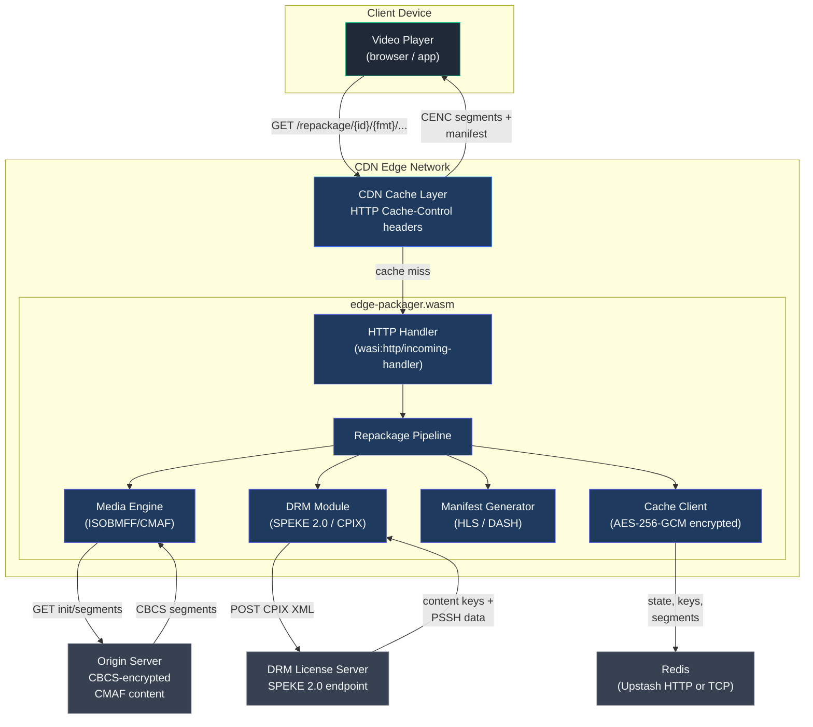
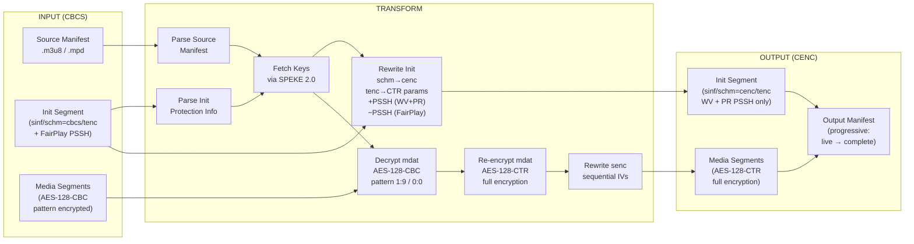
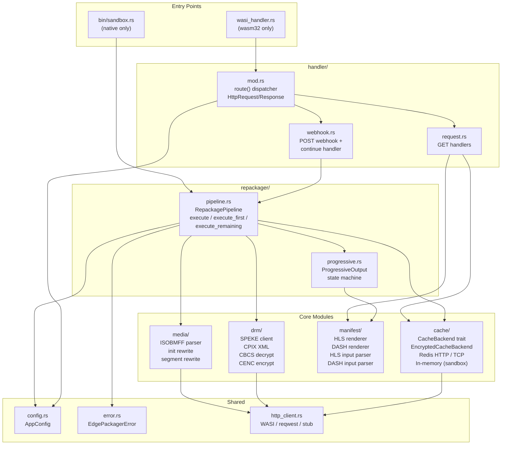
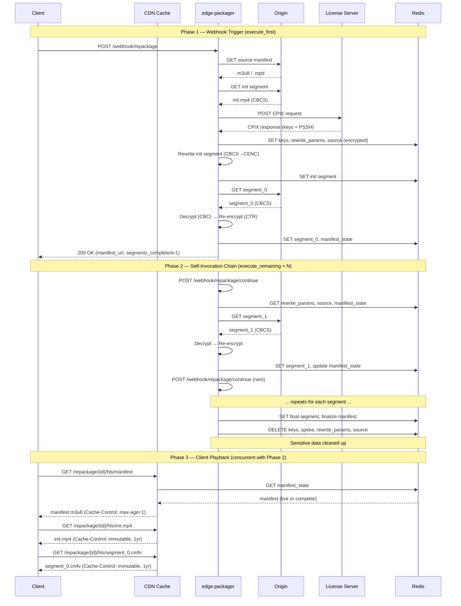
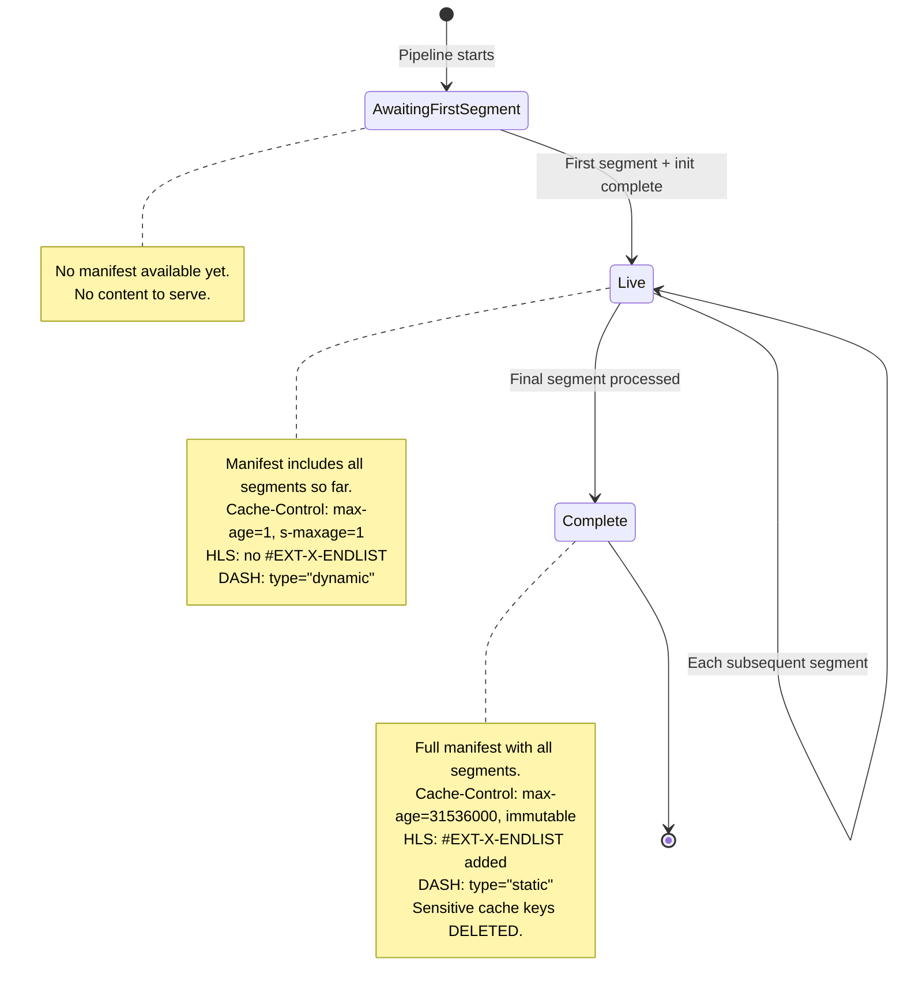
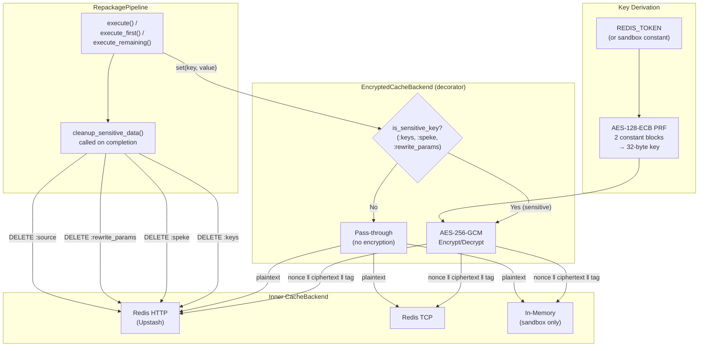
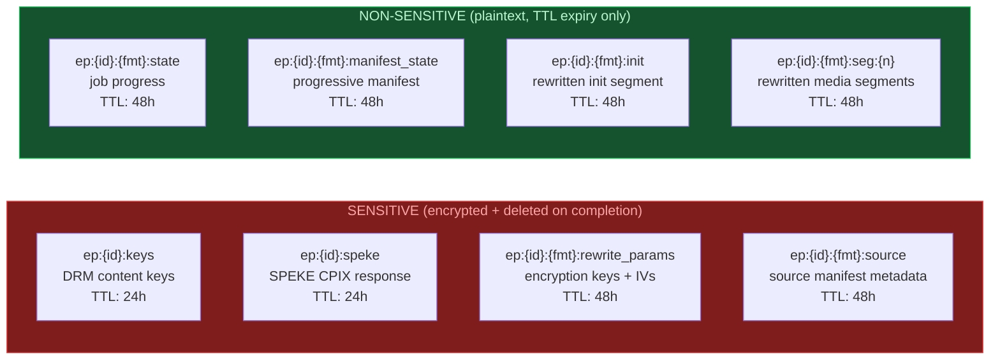
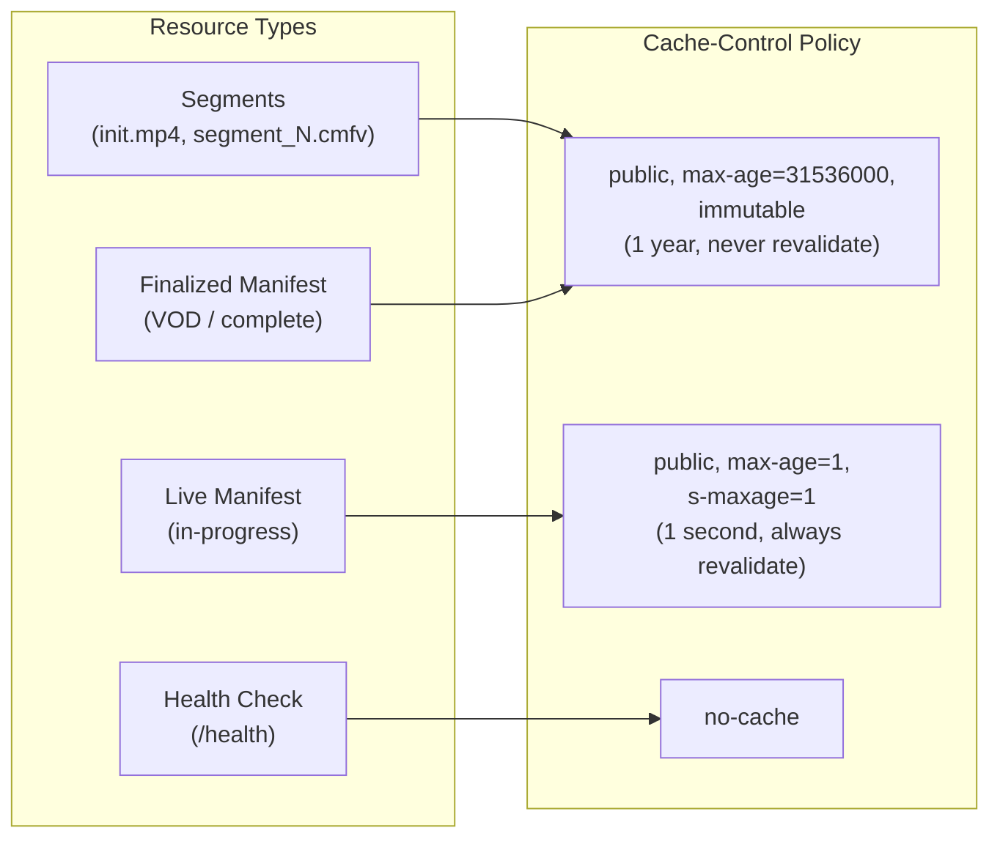
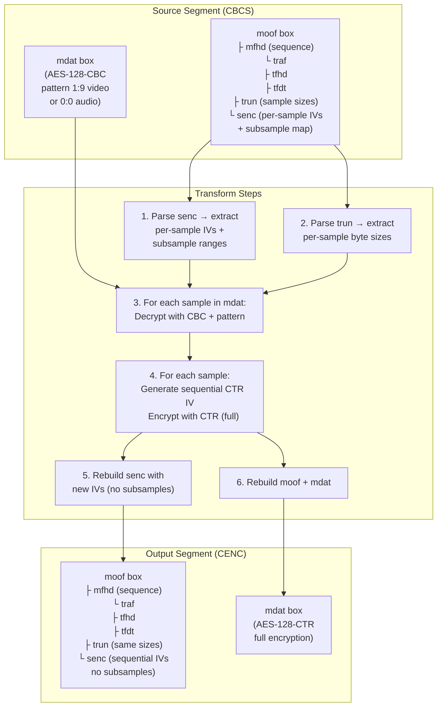

# edge-packager Architecture

All diagrams use [Mermaid](https://mermaid.js.org/) syntax. They render natively in Confluence (Mermaid macro), Jira (Mermaid code blocks), GitHub, and can be imported into Lucidchart via **File → Import → Mermaid**.

---

## 1. System Context

Shows how the edge-packager WASM module fits into the CDN infrastructure and its external dependencies.

---

## 2. Repackaging Data Flow

Shows the complete data transformation pipeline from CBCS input to CENC output.

---

## 3. Module Architecture

Shows the internal Rust module structure and dependency relationships.

---

## 4. Split Execution Model (WASI Chaining)

Shows how the pipeline handles WASI request timeouts by splitting work across self-invocations.

---

## 5. Progressive Output State Machine

Shows the manifest lifecycle phases and transitions.

---

## 6. Cache Security Model

Shows the two-layer security approach for sensitive data in Redis.

---

## 7. Cache Key Layout

Shows all Redis keys, their sensitivity classification, TTLs, and lifecycle.

---

## 8. CDN Caching Strategy

Shows how different resource types are cached at the CDN layer.

---

## 9. Encryption Transform Detail

Shows the per-segment CBCS-to-CENC transformation at the byte level.

---

## Key Features Summary

| Feature | Description |
|---------|-------------|
| **CBCS → CENC** | Transforms AES-128-CBC pattern encryption to AES-128-CTR full encryption |
| **Progressive Output** | Clients can begin playback as soon as the first segment is ready |
| **Split Execution** | WASI-compatible self-invocation chaining avoids request timeouts |
| **Encryption at Rest** | Sensitive cache entries (DRM keys, SPEKE responses) encrypted with AES-256-GCM |
| **Immediate Cleanup** | All sensitive data deleted from cache the moment processing completes |
| **Aggressive CDN Caching** | Segments and finalized manifests cached for 1 year; live manifests refresh every second |
| **Multi-DRM** | Widevine + PlayReady output; FairPlay recognized in input but excluded from output |
| **Zero External Test Dependencies** | All 432 tests use synthetic CMAF fixtures — no network or media files needed |
| **WASM-Native** | Entire runtime compiles to `wasm32-wasip2` with no async runtime or system calls |

## Inputs and Outputs

| Direction | What | Format | Protocol |
|-----------|------|--------|----------|
| **Input** | Source manifest | HLS `.m3u8` or DASH `.mpd` | HTTP GET from origin |
| **Input** | Source init segment | CMAF (CBCS sinf/schm/tenc/pssh) | HTTP GET from origin |
| **Input** | Source media segments | CMAF (CBC pattern encrypted mdat) | HTTP GET from origin |
| **Input** | DRM content keys | CPIX XML (SPEKE 2.0) | HTTP POST to license server |
| **Output** | Repackaged manifest | HLS `.m3u8` or DASH `.mpd` (CENC DRM signaling) | HTTP GET via CDN |
| **Output** | Repackaged init segment | CMAF (CENC schm/tenc/pssh, WV+PR only) | HTTP GET via CDN |
| **Output** | Repackaged media segments | CMAF (CTR full encrypted mdat) | HTTP GET via CDN |
| **Output** | Job status | JSON | HTTP GET via CDN |
