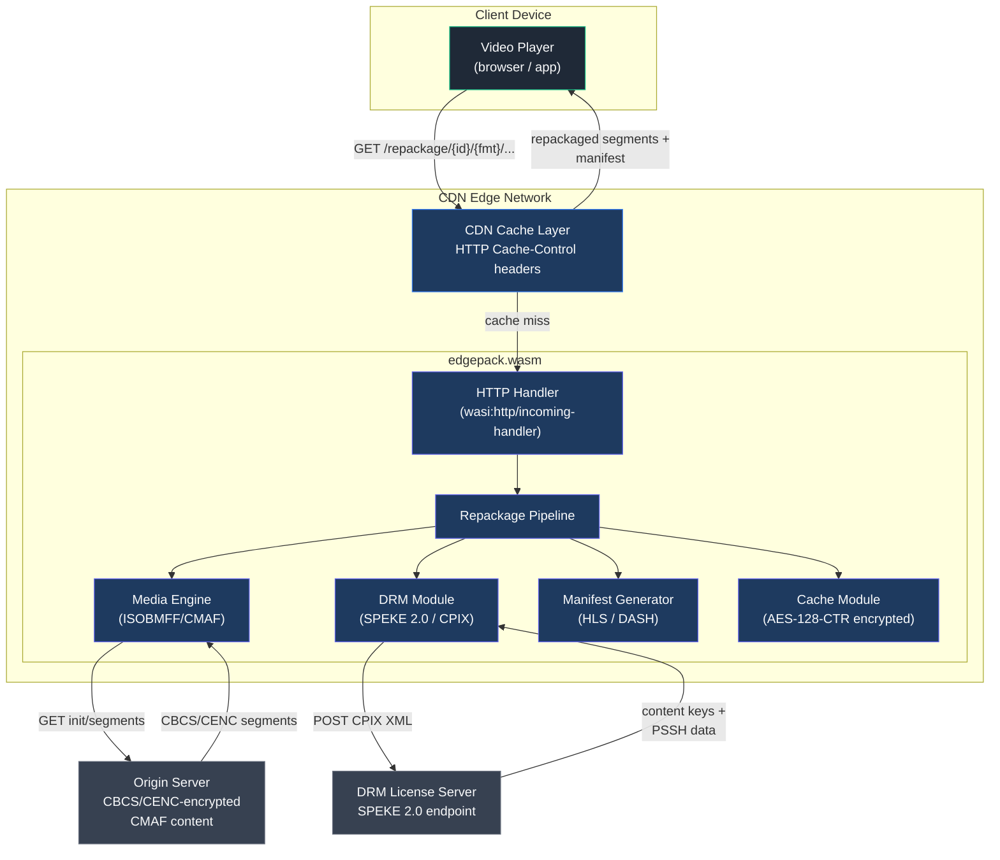
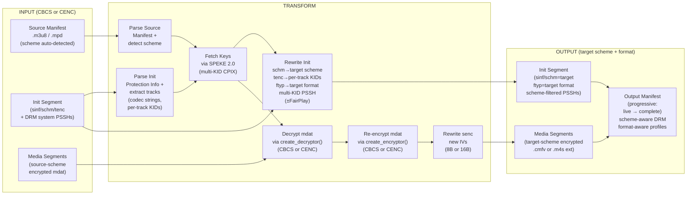
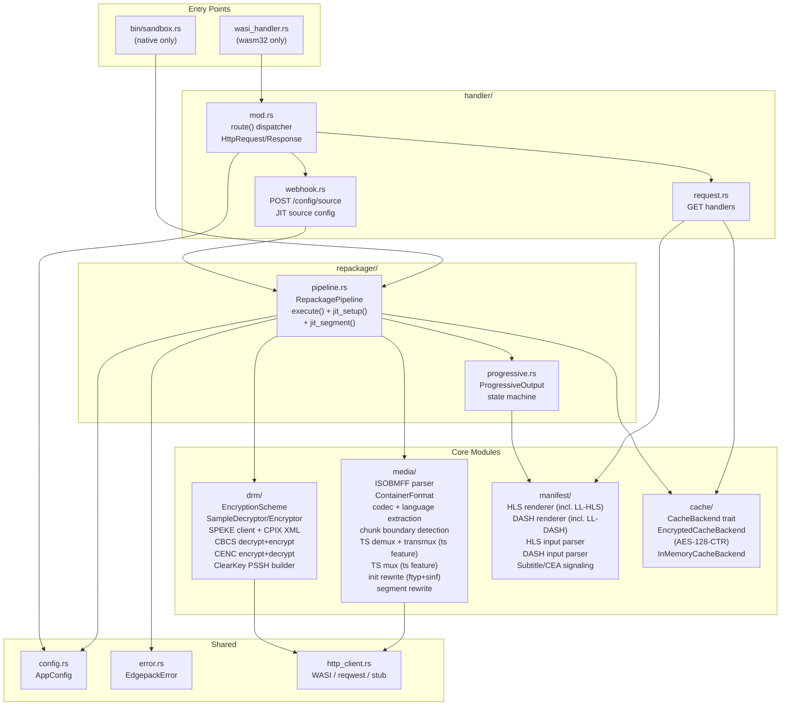
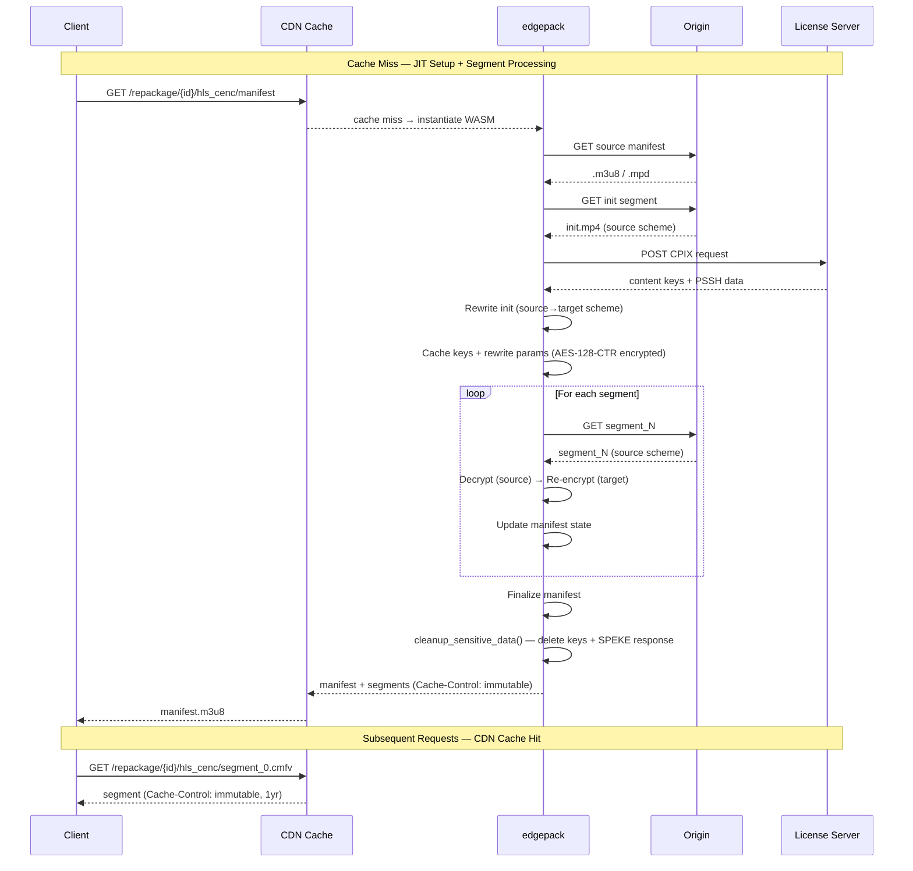
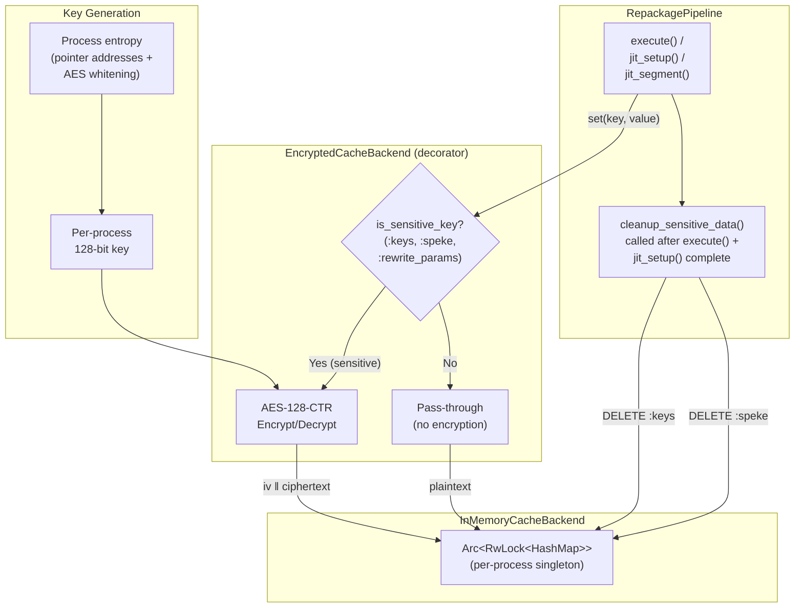
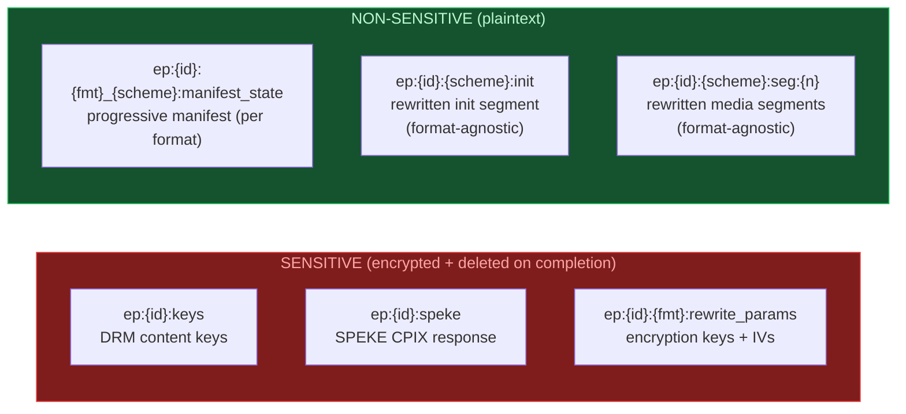
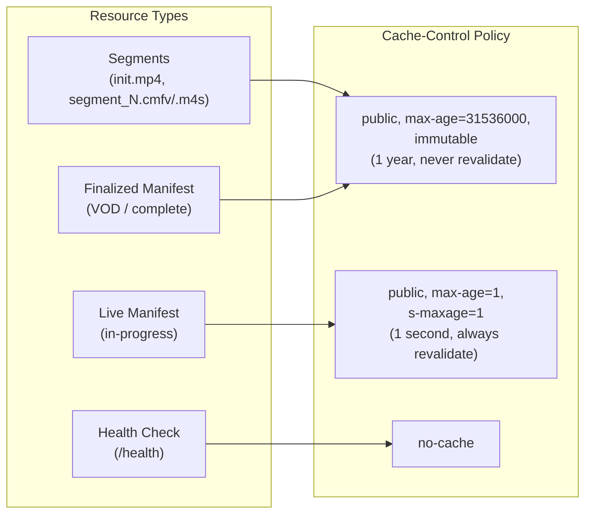
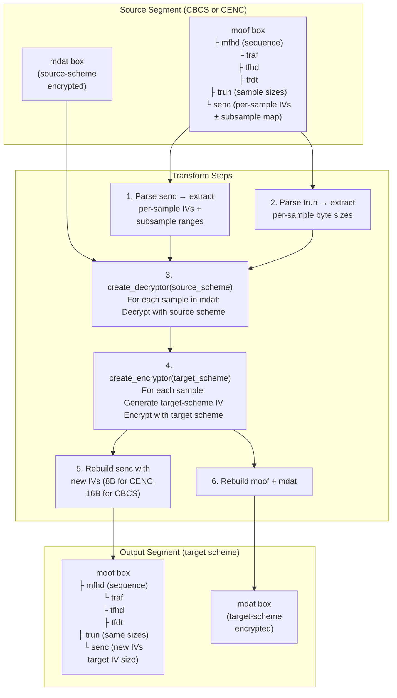
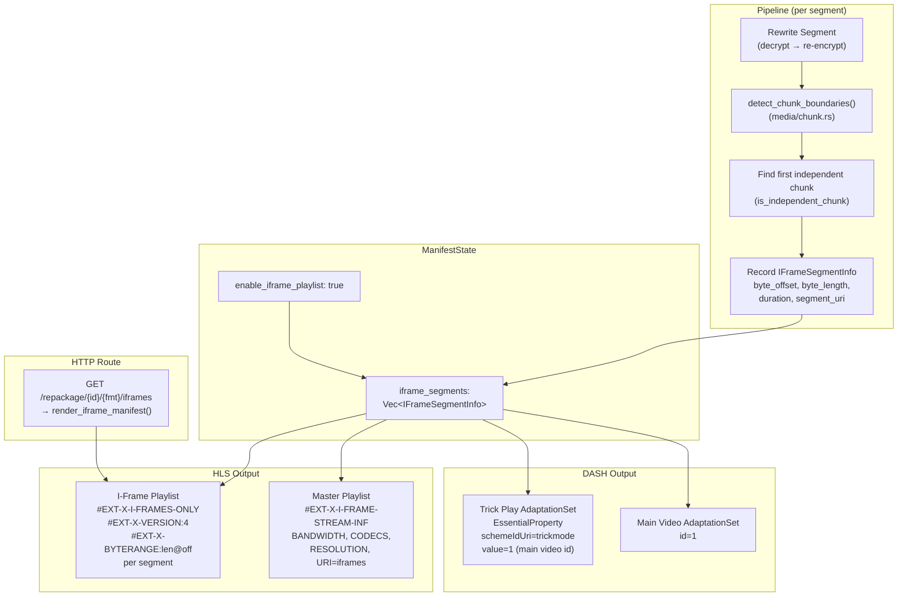
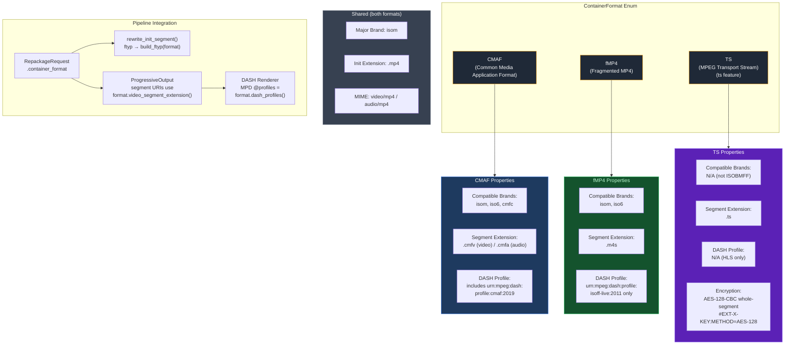

# edgepack Architecture

All diagrams use [Mermaid](https://mermaid.js.org/) syntax (11 diagrams total). They render natively in Confluence (Mermaid macro), Jira (Mermaid code blocks), GitHub, and can be imported into Lucidchart via **File → Import → Mermaid**.

---

## 1. System Context

Shows how the edgepack WASM module fits into the CDN infrastructure and its external dependencies.

---

## 2. Repackaging Data Flow

Shows the complete data transformation pipeline with configurable source/target encryption schemes and output container format.

---

## 3. Module Architecture

Shows the internal Rust module structure and dependency relationships.

---

## 4. JIT Execution Model

Shows how edgepack handles on-demand JIT packaging when content is requested for the first time.

---

## 5. Progressive Output State Machine

Shows the manifest lifecycle phases and transitions.

---

## 6. Cache Security Model

Shows the encryption-at-rest and cleanup approach for sensitive DRM data in the in-process cache.

---

## 7. Cache Key Layout

Shows all cache keys, their sensitivity classification, and lifecycle.

---

## 8. CDN Caching Strategy

Shows how different resource types are cached at the CDN layer.

---

## 9. Encryption Transform Detail

Shows the per-segment encryption transform at the byte level. Source and target schemes are configurable — the pipeline uses `create_decryptor()` and `create_encryptor()` factory functions to dispatch to the correct scheme implementation.

---

## 11. I-Frame Detection & Trick Play Flow

Shows how I-frame byte ranges are detected from rewritten segments and rendered as trick play manifests.

---

## Key Features Summary

| Feature | Description |
|---------|-------------|
| **Configurable Encryption** | Transforms between CBCS ↔ CENC in any direction; target scheme configurable per request |
| **Configurable Container Format** | Output as CMAF (`.cmfv`, `cmfc` brand), fMP4 (`.m4s`), or TS (`.ts`, HLS-only); ftyp rewriting, dynamic DASH profiles |
| **Source Scheme Auto-Detection** | Detects source encryption from init segment `schm` box or manifest DRM signaling |
| **Trait-Based Crypto Dispatch** | `SampleDecryptor`/`SampleEncryptor` traits with factory functions for scheme-agnostic pipeline |
| **Progressive Output** | Clients can begin playback as soon as the first segment is ready |
| **JIT Packaging** | On-demand GET packaging — manifest/init/segment on cache miss with <1 ms cold start |
| **Encryption at Rest** | Sensitive cache entries (DRM keys, SPEKE responses) encrypted with AES-128-CTR per-process key |
| **Immediate Cleanup** | All sensitive data deleted from cache the moment processing completes |
| **Aggressive CDN Caching** | Segments and finalized manifests cached for 1 year; live manifests refresh every second |
| **Multi-DRM** | Widevine + PlayReady for CENC output; FairPlay + Widevine + PlayReady for CBCS output |
| **Multi-Key DRM** | Per-track keying (separate video/audio KIDs), multi-KID PSSH v1 boxes, TrackKeyMapping |
| **Codec Awareness** | RFC 6381 codec string extraction from init segments for manifest signaling |
| **Subtitle Pass-Through** | WebVTT/TTML in fMP4, HLS subtitle rendition groups, DASH text AdaptationSets, CEA-608/708 caption signaling |
| **Sub-Millisecond Cold Start** | ~628 KB WASM binary instantiates in <1 ms, 50-500x faster than Lambda/Cloud Functions |
| **SCTE-35 Ad Break Signaling** | emsg box extraction, splice event parsing, HLS `#EXT-X-DATERANGE` and DASH `EventStream` output, source manifest ad marker roundtrip |
| **Compatibility Validation** | Pre-flight codec/scheme checks, HDR format detection, init/segment structure validation, conformance test suite |
| **Advanced DRM** | ClearKey DRM system, raw key mode (bypass SPEKE), key rotation at segment boundaries, clear lead (unencrypted lead-in segments), explicit DRM system selection per request |
| **LL-HLS** | Low-Latency HLS with partial segments (`#EXT-X-PART`), server control (`#EXT-X-SERVER-CONTROL`), CMAF chunk boundary detection, HLS version 9 |
| **LL-DASH** | Low-Latency DASH with `availabilityTimeOffset` and `availabilityTimeComplete` on `<SegmentTemplate>` |
| **MPEG-TS Input** | TS demuxer (PAT/PMT/PES, H.264/AAC), TS-to-CMAF transmuxer (Annex B→AVCC, init synthesis), AES-128 segment decryption. Feature-gated (`ts` feature) |
| **MPEG-TS Output** | CMAF-to-TS muxer (AVCC→Annex B, raw AAC→ADTS, PAT/PMT/PES packetization), AES-128-CBC whole-segment encryption, HLS-TS manifests (`METHOD=AES-128`, no `#EXT-X-MAP`), key delivery endpoint. Feature-gated (`ts` feature) |
| **Trick Play** | HLS `#EXT-X-I-FRAMES-ONLY` playlists with `#EXT-X-BYTERANGE` into existing segments, `#EXT-X-I-FRAME-STREAM-INF` in master. DASH trick play `<AdaptationSet>` with `<EssentialProperty>` trickmode. I-frame detection from CMAF chunk boundaries — no duplicate storage |
| **Dual-Format Output** | Simultaneous HLS + DASH from a single request sharing format-agnostic segments. `output_formats: ["hls", "dash"]` produces both manifest types referencing the same cached segments — no duplicate encryption or storage |
| **Binary Size Guards** | Tests enforce WASM binary size limits per build variant. Binary size is the primary cold start proxy |
| **Zero External Test Dependencies** | All 1,452 tests (1,290 without `ts` feature) use synthetic CMAF fixtures — no network or media files needed |
| **CDN-Portable WASM** | Entire runtime compiles to `wasm32-wasip2` — runs on any CDN with WASI P2 support (Cloudflare Workers, Fastly Compute, wasmtime on Lambda, Akamai EdgeCompute). No CDN-specific APIs, no vendor lock-in |

## Inputs and Outputs

| Direction | What | Format | Protocol |
|-----------|------|--------|----------|
| **Input** | Source manifest | HLS `.m3u8` or DASH `.mpd` (source scheme auto-detected) | HTTP GET from origin |
| **Input** | Source init segment | CMAF (CBCS or CENC sinf/schm/tenc/pssh) | HTTP GET from origin |
| **Input** | Source media segments | CMAF (source-scheme encrypted mdat) | HTTP GET from origin |
| **Input** | Source TS segments | MPEG-TS (H.264/AAC, optional AES-128 encryption) | HTTP GET from origin (`ts` feature) |
| **Input** | AES-128 key | Raw key bytes for HLS-TS segment decryption | HTTP GET from key URL (`ts` feature) |
| **Input** | DRM content keys | CPIX XML (SPEKE 2.0) | HTTP POST to license server |
| **Output** | Repackaged manifest | HLS `.m3u8` or DASH `.mpd` (target-scheme DRM signaling, format-aware profiles) | HTTP GET via CDN |
| **Output** | Repackaged init segment | CMAF or fMP4 (target-scheme schm/tenc/pssh, target-format ftyp brands, DRM systems per scheme) | HTTP GET via CDN |
| **Output** | Repackaged media segments | CMAF `.cmfv`, fMP4 `.m4s`, or TS `.ts` (target-scheme encrypted) | HTTP GET via CDN |

---

## Completed Architecture Extensions

### ~~Phase 2: Container Format Flexibility~~ ✅ Complete
- `ContainerFormat` enum (`Cmaf`, `Fmp4`, `Iso`) in `src/media/container.rs` with brand, extension, profile helpers
- ftyp box rewriting in init segments for output container format
- Dynamic segment extensions (`.cmfv`/`.cmfa` for CMAF, `.m4s` for fMP4, `.mp4` for ISO)
- Dynamic DASH profile signaling (`cmaf:2019` for CMAF, `isoff-live:2011` for fMP4/ISO)
- `container_format` flows through `RepackageRequest` → `ManifestState` → `ProgressiveOutput`
- Route handler accepts all 7 CMAF/ISOBMFF segment extensions

### ~~Phase 3: Unencrypted Input Support~~ ✅ Complete
- `EncryptionScheme::None` variant with `is_encrypted()` method
- Four-way init/segment dispatch (encrypted↔encrypted, clear→encrypted, encrypted→clear, clear→clear)
- `create_protection_info()` / `strip_protection_info()` / `rewrite_ftyp_only()` in init.rs
- Conditional SPEKE — skipped when both source and target are unencrypted

### ~~Phase 4: Dual-Scheme Output~~ ✅ Complete
- Multi-rendition pipeline: loop over target schemes, produce independent segment sets
- Scheme-qualified cache keys (`{format}_{scheme}` pattern, e.g. `hls_cenc`)
- Scheme-qualified URL routes (e.g. `/repackage/{id}/hls_cenc/manifest`)
- Source segments decrypted once, re-encrypted for each target scheme

### ~~Phase 5: Multi-Key DRM & Codec Awareness~~ ✅ Complete
- `TrackKeyMapping` type mapping `TrackType → [u8; 16]` KID for per-track keying
- Per-track `tenc` in init segments — video and audio tracks get different KIDs via `hdlr` detection
- Multi-KID PSSH v1 — grouped by `system_id`, all track KIDs embedded per DRM system
- Codec string extraction via `extract_tracks()` in `src/media/codec.rs` — RFC 6381 codec strings from stsd config boxes (avcC, hvcC, esds, vpcC, av1C, wvtt, stpp)
- Timescale and language parsing from `mdhd` box (ISO 639-2/T packed 3×5-bit chars)
- Pipeline integration: `extract_tracks()` → `build_track_key_mapping()` → multi-KID SPEKE → per-track init rewriting
- Codec strings populated into `VariantInfo` for HLS `CODECS=` and DASH `codecs=` manifest attributes

### ~~Phase 6: Subtitle & Text Track Pass-Through~~ ✅ Complete
- WebVTT (`wvtt`) and TTML (`stpp`) sample entry pass-through in fMP4 — subtitles bypass encryption via `encrypted_sample_entry_type()` returning `None`
- `TrackMediaType::Subtitle` enum variant, `language` field on `VariantInfo` and `TrackInfo`
- ISO 639-2/T language extraction from `mdhd` box (packed 3×5-bit chars)
- `CeaCaptionInfo` struct for CEA-608/708 manifest signaling (pass-through automatic in video SEI NALs)
- HLS subtitle rendition groups (`#EXT-X-MEDIA:TYPE=SUBTITLES,GROUP-ID="subs"`) with `SUBTITLES="subs"` on `EXT-X-STREAM-INF`
- HLS CEA caption signaling (`#EXT-X-MEDIA:TYPE=CLOSED-CAPTIONS,INSTREAM-ID=...`) with `CLOSED-CAPTIONS="cc"` on `EXT-X-STREAM-INF`
- DASH subtitle `<AdaptationSet contentType="text" mimeType="application/mp4">` with `lang` attribute
- DASH CEA `<Accessibility schemeIdUri="urn:scte:dash:cc:cea-608:2015">` descriptors inside video AdaptationSet

### ~~Phase 8: JIT Packaging (On-Demand GET)~~ ✅ Complete
- Manifest-on-GET, Init-on-GET, Segment-on-GET (lazy repackaging on cache miss)
- Request coalescing via `set_nx` distributed locking with configurable TTL
- `POST /config/source` endpoint for per-content source configuration
- URL pattern-based source resolution with `{content_id}` placeholder

### ~~Phase 9: LL-HLS & LL-DASH~~ ✅ Complete
- LL-HLS partial segments: `#EXT-X-PART`, `#EXT-X-PART-INF`, `#EXT-X-SERVER-CONTROL`, `#EXT-X-PRELOAD-HINT`
- LL-DASH: `availabilityTimeOffset` and `availabilityTimeComplete` on `<SegmentTemplate>`
- CMAF chunk boundary detection (`src/media/chunk.rs`) — finds moof+mdat pairs, checks independence via trun flags
- New types: `PartInfo`, `ServerControl`, `LowLatencyDashInfo`, `SourcePartInfo`
- Progressive output part support (`add_part()`, `part_data()`, LL setter methods)
- HLS version bump to 9 when LL-HLS parts present
- Source LL info threaded through pipeline to output manifests

### ~~Phase 10: MPEG-TS Input~~ ✅ Complete
- Feature-gated: all TS code behind `#[cfg(feature = "ts")]`
- TS demuxer (`src/media/ts.rs`): 188-byte packet parsing, PAT/PMT table parsing, PES reassembly, `TsDemuxer` stateful accumulator
- TS-to-CMAF transmuxer (`src/media/transmux.rs`): H.264 NAL extraction (Annex B→AVCC), SPS parsing, AAC ADTS config, init segment synthesis (ftyp+moov), moof+mdat fragment generation
- AES-128-CBC whole-segment decryption for HLS-TS (`decrypt_ts_segment()`)
- HLS input TS detection: `.ts` extension, `#EXT-X-KEY:METHOD=AES-128` with URI/IV, optional `#EXT-X-MAP`
- Pipeline integration: feature-gated `process_ts_segment()` — decrypt → demux → transmux → CMAF pipeline

### ~~Phase 11: Advanced DRM~~ ✅ Complete
- ClearKey DRM system ID (`e2719d58-a985-b3c9-781a-b030af78d30e`) with local PSSH builder (JSON `{"kids":["base64url"]}`)
- Raw key mode: accept encryption keys directly via webhook, bypass SPEKE
- Key rotation: per-period key rotation at configurable segment boundaries, new DRM signaling per period
- Clear lead: first N segments unencrypted, manifest transition at boundary
- DRM systems override: explicit selection of widevine/playready/fairplay/clearkey per request

### ~~Phase 12: Trick Play & I-Frame Playlists~~ ✅ Complete
- `IFrameSegmentInfo` type in `manifest/types.rs` — byte offset, length, duration, segment URI per I-frame
- `enable_iframe_playlist` opt-in field on `ManifestState` and `RepackageRequest` (default false, `#[serde(default)]` for backward compat)
- I-frame detection reuses `chunk.rs` — `detect_chunk_boundaries()` → find first independent (IDR) chunk → record byte range
- Consolidated chunk detection in pipeline — runs once when either LL-HLS parts or I-frame playlists need it
- HLS I-frame playlist: `#EXT-X-I-FRAMES-ONLY`, `#EXT-X-VERSION:4`, `#EXT-X-BYTERANGE:length@offset`, DRM KEY tags, init MAP
- HLS master playlist: `#EXT-X-I-FRAME-STREAM-INF` per video variant (bandwidth/10, codecs, resolution)
- DASH trick play: separate `<AdaptationSet>` with `<EssentialProperty schemeIdUri="http://dashif.org/guidelines/trickmode" value="1"/>` referencing main video by `id="1"`
- Dedicated route: `GET /repackage/{id}/{fmt}/iframes` (HLS only, DASH returns 404)
- Sandbox writes `iframes.m3u8` alongside regular HLS output

### ~~Phase 21: Generic HLS/DASH Pipeline (Dual-Format)~~ ✅ Complete
- `RepackageRequest.output_formats: Vec<OutputFormat>` replaces singular `output_format` — backward-compatible webhook API
- Format-agnostic segment cache keys: `ep:{id}:{scheme}:init` and `ep:{id}:{scheme}:seg:{n}` (no format prefix — segments are identical for HLS and DASH)
- Per-format manifest state: `ep:{id}:{format}_{scheme}:manifest_state` stays format-qualified (manifests differ per format)
- `execute()` returns `Vec<(OutputFormat, EncryptionScheme, ProgressiveOutput)>` — one output per (format, scheme) pair
- Re-encryption runs once per scheme, then distributed to all output formats
- Combinatorial output: `output_formats: [Hls, Dash]` × `target_schemes: [Cenc, Cbcs]` = 4 outputs

### ~~Phase 22: MPEG-TS Output~~ ✅ Complete
- Feature-gated: behind existing `#[cfg(feature = "ts")]` gate (same as TS input)
- `ContainerFormat::Ts` variant — `.ts` extension, `is_isobmff()` returns false, no init segment, HLS-only (DASH+TS rejected)
- TS muxer (`src/media/ts_mux.rs`): CMAF moof/mdat → 188-byte TS packets (AVCC→Annex B, raw AAC→ADTS, PAT/PMT/PES)
- AES-128-CBC whole-segment encryption (`encrypt_ts_segment()` — reverse of Phase 10's `decrypt_ts_segment()`)
- HLS manifest: no `#EXT-X-MAP`, `#EXT-X-KEY:METHOD=AES-128,URI="{key_uri}"`, `#EXT-X-VERSION:3`, `.ts` segment URIs
- Key delivery endpoint: `GET /repackage/{id}/{format}/key` serves raw 16-byte AES key
- Pipeline: `TsMuxConfig` extracted from init segment, segments muxed via `mux_to_ts()`
- Validation: TS+DASH rejected, webhook accepts `"ts"` as container_format

## Planned Architecture Extensions

All P0 and P1 items are complete. Remaining phases are P2. See [`roadmap.md`](roadmap.md) for details.

---

## 10. Container Format Comparison

Shows the differences between CMAF and fMP4 output formats and how they flow through the system.

